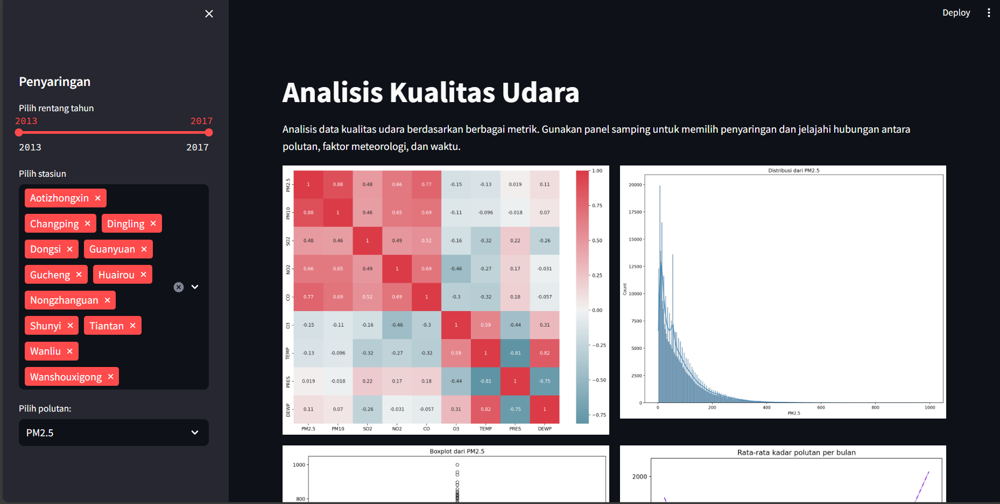

# Analisis Kualitas Udara

Dashboard analisis kualitas udara yang menggunakan Streamlit. Dashboard ini memungkinkan pengguna untuk menganalisis data kualitas udara berdasarkan berbagai metrik dan hubungan antara polutan, faktor meteorologi, dan waktu.

 


## Fitur

- Pemetaan korelasi antara polutan dan kondisi cuaca.
- Histogram distribusi dari polutan terpilih.
- Boxplot untuk melihat distribusi polutan.
- Analisis variasi harian dan musiman dari polutan.
- Pengaruh stasiun pengukuran terhadap kadar polutan.
- Dampak hujan dan arah angin pada kualitas udara.

## Instalasi

1. Clone repositori ini:

```bash
git clone https://github.com/afdanirawan/submission.git
cd directory_of_your_repository
```

2. Buat virtual environment dan aktifkan:

```bash
python -m venv venv
source venv/bin/activate  # Untuk Linux/macOS
venv\Scripts\activate     # Untuk Windows
```

3. Install semua dependensi:

```bash
pip install -r requirements.txt
```

4. Jalankan Streamlit app:

```bash
cd dashboard
streamlit run dashboard.py
```

## Data

Data yang digunakan berasal dari file `main_data.csv`. Pastikan file ini berada dalam direktori yang sama dengan skrip Anda.
